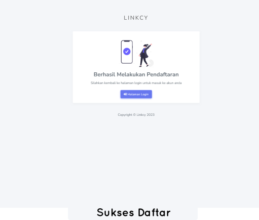
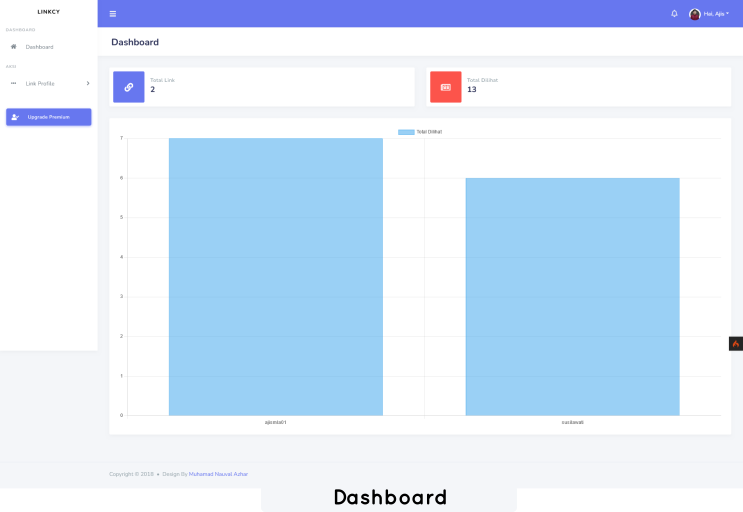
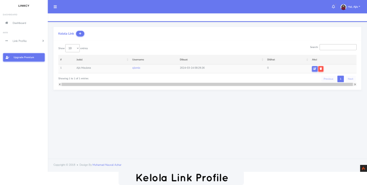
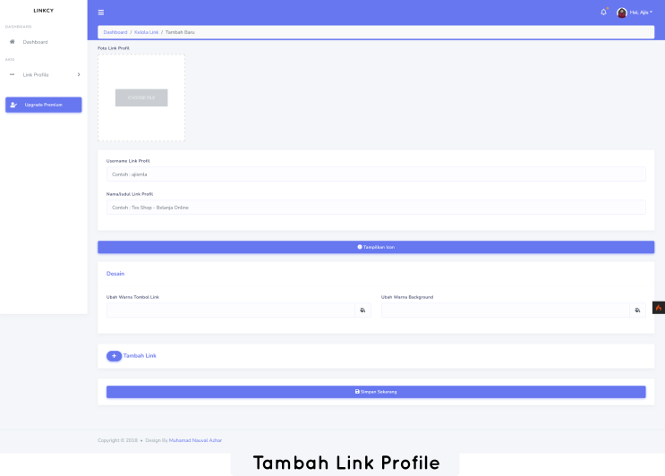
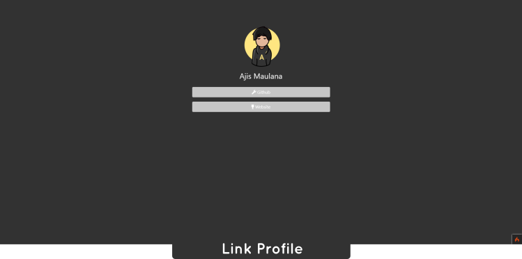
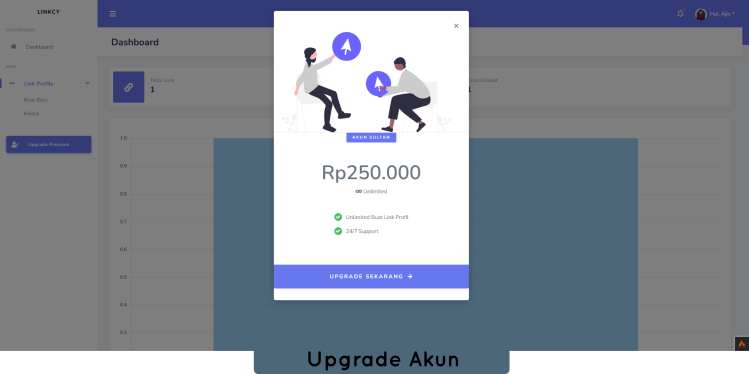
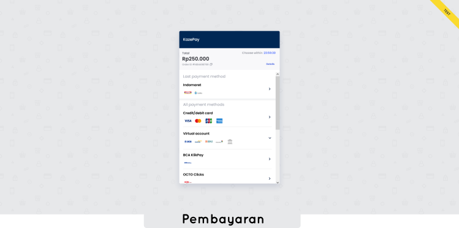

# LinkCy - Link Profile
<p align="center">
  
</p>

## Apa Itu LinkCy

LinkCy adalah aplikasi tautan bio yang memungkinkan kamu menautkan ke semua situs web, postingan sosial, video, musik, dan banyak lagi. 
Web ini belum ada laman admin dan cocok untuk pembelajaran atau di kembangkan 😊.

Dibuat dengan CodeIgniter 4, framework web full-stack PHP yang ringan, cepat, fleksibel, dan aman.
Informasi lebih lanjut dapat ditemukan di [situs resmi CodeIgniter](https://codeigniter.com).

## Persyaratan Server

PHP versi 7.4 atau yang lebih tinggi diperlukan, dengan instalasi ekstensi berikut:

- [intl](http://php.net/manual/en/intl.requirements.php)
- [mbstring](http://php.net/manual/en/mbstring.installation.php)

Pastikan juga bahwa ekstensi berikut diaktifkan di PHP Anda:

- json (diaktifkan secara default - jangan nonaktifkan)
- [mysqlnd](http://php.net/manual/en/mysqlnd.install.php) jika Anda berencana menggunakan MySQL
- [libcurl](http://php.net/manual/en/curl.requirements.php) jika Anda berencana menggunakan perpustakaan HTTP\CURLRequest

## Demo
<p align="center">
  
  
  
  
  
  
  
</p>


---

**Konfigurasi Midtrans**

```php
\Midtrans\Config::$serverKey = 'KEY_DISINI';
// Set ke Lingkungan Pengembangan/Sandbox (default). Atur ke true untuk Lingkungan Produksi (menerima transaksi nyata).
\Midtrans\Config::$isProduction = false;
// Atur sanitasi (default)
\Midtrans\Config::$isSanitized = true;
// Atur transaksi 3DS untuk kartu kredit ke true
\Midtrans\Config::$is3ds = true;
$price = 250000;
```

---

**Konfigurasi Databse (ENV)**
```database.default.hostname = localhost
database.default.database = db_linkcy
database.default.username = root
database.default.password = 
database.default.DBDriver = MySQLi
database.default.DBPrefix =
database.default.port = 3306
```
---

**Run**
```php
php spark serve
```

